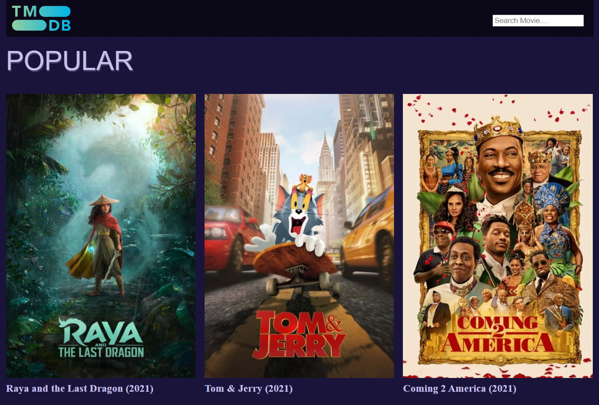
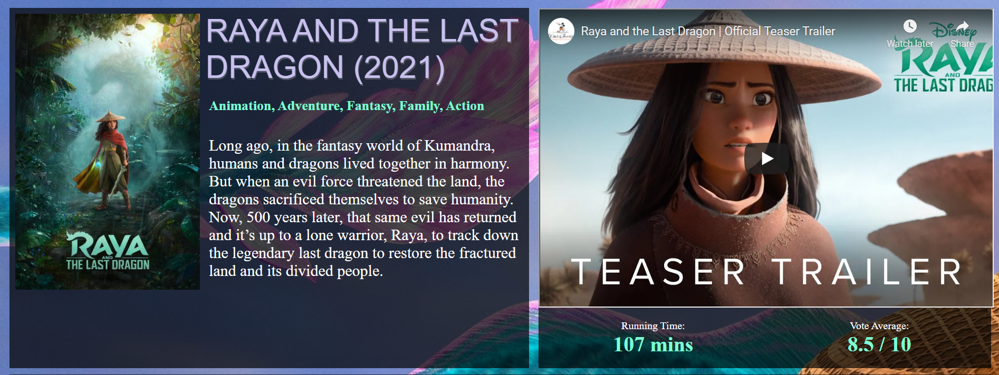

# TMBD Movies

### `In progress...`

<p>
  TMDb Movies is a JavaScript application that loads data through <a href="https://www.themoviedb.org/documentation/api">The Movie Database (TMDb) API.</a>
</p>
<p>
This application is implemented using:
</p>
<table>
  <tr>
    <th>CSS</th>
    <td>HTML</td>
    <th>JS</th>
  </tr>
</table>





# Tools
<table>
  <tr>
    <th>Tool</th>
    <th>Description</th>
  </tr>
  <tr>
    <td>tiny-slider.js</td>
    <td>Slider JavaScript, works on Firefox 12+, Chrome 15+, Safari 4+, Opera 12.1+, IE8+. </td>
  </tr>
</table>


# Installation

<table>
 <th> <b>git clone</b> https://github.com/sabedd00/js-movies.git</th>
</table>

After creation, your project should look like this:

```
js-movies/
  src/
    css/
      main.css
      movie-details.css
    docs/
      images/
        main-page.png
        movie-details.png
        slider-of-similar-movie.gif
    images/
      empty-poster.png
      tmdb-logo.svg
    js/
      config.js
      index.js
      movie-details.js
      search-results.js
  .gitignore    
  README.md
  index.html    
  package.json
  package-lock.json
  webpack.config.js
```

In the project directory, you can run:

### `npm run build`
### `npm start`
