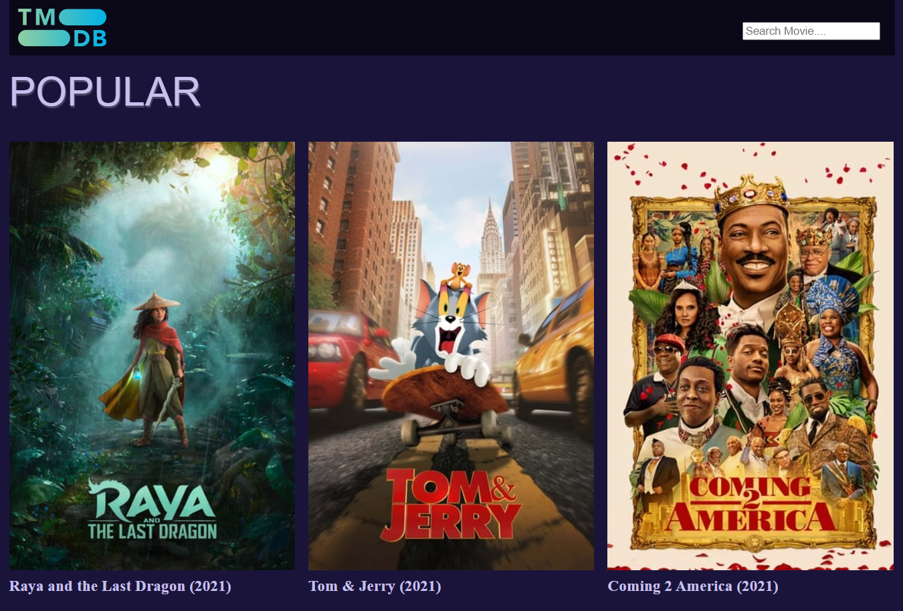
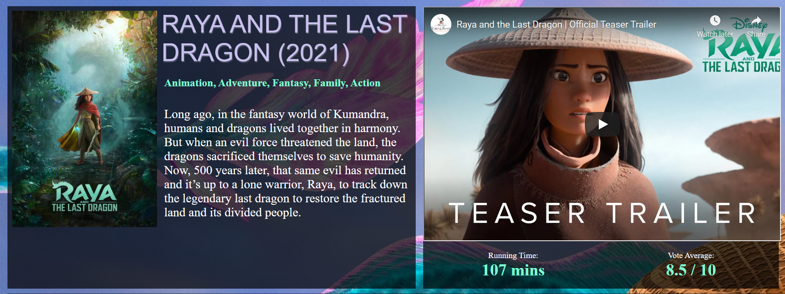

# TMBD Movies

  In progress...

  TMDb Movies is a JavaScript application that loads data through <a href="https://www.themoviedb.org/documentation/api">The Movie Database (TMDb) API.</a>

# Tools
<table>
  <tr>
    <th>Tool</th>
    <th>Description</th>
  </tr>
  <tr>
    <td>tiny-slider.js</td>
    <td>Slider JavaScript, works on Firefox 12+, Chrome 15+, Safari 4+, Opera 12.1+, IE8+. </td>
  </tr>
</table>

