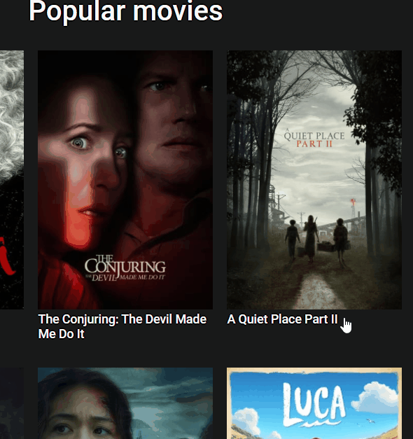

# JS MOVIES
#### Web App using <a href="https://developers.themoviedb.org/3/getting-started">The Movie DB API.</a> This application is implemented using: HTML, CSS and JS without frameworks. Shows a list of the Movies by popularity, clicking on a movie will open a page with details. It is also possible to search for movies.

<table>
  
  <tr>
  <th></th>
  <th></th>
  </tr>
</table>

# Library Used
- Glider.js

# Installation
#### `npm install`
#### `npm run build`
#### `npm start`
